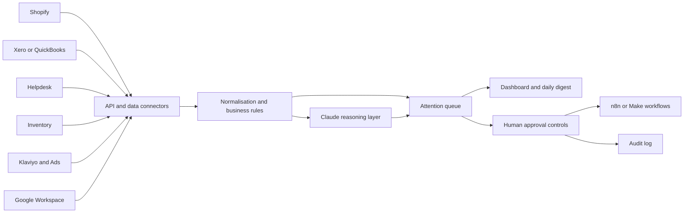

# Heritage Ops Agent

A working proof of concept for a UK luxury watch and accessories brand that needs one clear view across orders, stock, finance, customer service, and marketing.

The demo identifies exceptions, prioritises what needs attention, produces an executive daily briefing, and supports controlled actions with an activity log.

## Live demo

After GitHub Pages is enabled for the `/docs` folder, the interactive demo will be available at:

`https://adamhumen123-blip.github.io/heritage-ops-agent-demo/`

The browser demo lets a client:

- Review executive KPIs
- Run the Attention Agent
- Inspect critical and high-priority exceptions
- Approve or assign recommended actions
- See queue counts update immediately
- Review the resulting activity log

## What the pilot demonstrates

- A daily **“what needs my attention?”** management view
- Cross-functional order, inventory, finance, service, and marketing alerts
- Commercial prioritisation of exceptions
- Recommended next actions
- Human approval controls
- An auditable decision trail
- A clear path from sample data to live API integrations

## Architecture



## Recommended first paid pilot

Connect one live commerce source and one operational source, then automate one complete daily-attention workflow:

1. Authenticate Shopify and the selected accounting, inventory, or helpdesk platform.
2. Agree 8–12 high-value exception rules.
3. Normalise and reconcile the source data.
4. Generate a prioritised daily digest.
5. Route approved actions through n8n or Make.
6. Track outcomes, errors, false positives, and time saved.

Suggested success measures include response-SLA improvement, overdue cash recovered, stock-outs prevented, manual hours saved, and exception false-positive rate.

## Production hardening

The current public demo uses safe sample data. A production deployment would add authenticated API connectors, scheduled ingestion and webhooks, idempotent jobs, role-based access, encrypted secret management, retries, monitoring, backups, reconciliation controls, and documented handover procedures.

## Repository structure

```text
docs/index.html          Interactive GitHub Pages demonstration
CLIENT_DEMO_GUIDE.md     90-second presentation walkthrough
.env.example             Example environment variables for the production build
```

## Scope note

This is a proof of concept and does not claim to be connected to a client’s private Shopify, Xero, Klaviyo, Google Workspace, inventory, or helpdesk accounts. Those authenticated connections form the next paid implementation stage.
