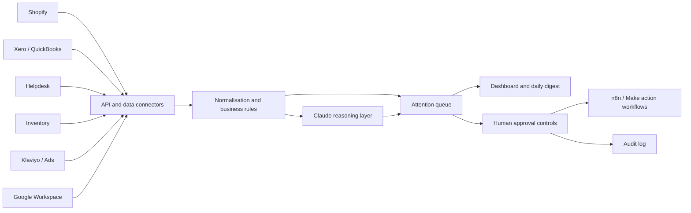

# Heritage Ops Agent

A working proof of concept for a luxury watch and accessories business that needs one clear view across orders, stock, finance, customer service, and marketing.

The pilot identifies exceptions, prioritises what needs attention, produces an executive daily briefing, and supports controlled actions with an audit trail.


## What this pilot demonstrates

- Executive KPI view across five operating areas
- Automated detection of order, stock, cash, service, and marketing exceptions
- Critical, high, and medium commercial prioritisation
- Daily **“what needs my attention?”** briefing
- Recommended next actions for every exception
- Approve, assign, and dismiss workflows
- Persistent action and audit history
- Data-source health monitoring
- Optional Claude-powered executive briefing

## Try it in a browser

The `docs/` folder contains a GitHub Pages version that runs entirely in the browser with realistic sample data. It supports the dashboard, attention-agent run, action approvals, assignments, dismissals, and a local audit trail.

After this repository is published:

1. Open **Settings → Pages**.
2. Select **Deploy from a branch**.
3. Choose branch **main** and folder **/docs**.
4. Save and use the generated Pages URL as the client-facing live demo.

The browser version is intentionally self-contained. The full Python version below demonstrates the backend structure used for production integrations.

## Run the full working pilot locally

### Windows

1. Install Python 3.10 or newer.
2. Double-click `start.bat`.
3. Open `http://127.0.0.1:8000`.

No package installation is required.

### macOS or Linux

```bash
chmod +x start.sh
./start.sh
```

Then open `http://127.0.0.1:8000`.

## Optional Claude mode

The pilot works without an API key through its deterministic rules engine. Claude can refine the executive briefing when these environment variables are supplied:

```bash
export ANTHROPIC_API_KEY="your-key"
export ANTHROPIC_MODEL="a-model-enabled-on-your-account"
python server.py
```

Windows PowerShell:

```powershell
$env:ANTHROPIC_API_KEY="your-key"
$env:ANTHROPIC_MODEL="a-model-enabled-on-your-account"
python server.py
```

The API key remains server-side and is never sent to the browser.

## Architecture



## Recommended first paid pilot

Connect one live commerce source and one operational source, then automate a complete daily-attention workflow:

1. Authenticate Shopify and the selected accounting, inventory, or helpdesk platform.
2. Agree 8–12 high-value exception rules.
3. Normalise and reconcile the source data.
4. Generate a prioritised daily digest.
5. Route approved actions through n8n or Make.
6. Track outcomes, errors, false positives, and time saved.

Suggested success measures include response-SLA improvement, overdue cash recovered, stock-outs prevented, manual hours saved, and exception false-positive rate.

## Production hardening

The current repository uses safe demonstration data. A production deployment would add authenticated API connectors, webhooks and scheduled ingestion, idempotent jobs, role-based access, encrypted secret management, monitoring, retries, backups, reconciliation controls, and documented handover procedures.

## Repository structure

```text
app/                       Full dashboard frontend
server.py                  Python API, rules engine, SQLite and Claude integration
start.bat / start.sh       Local launchers
docs/                      GitHub Pages interactive demo and dashboard preview
CLIENT_DEMO_GUIDE.md       90-second client walkthrough
GITHUB_PUBLISH_GUIDE.md    Publishing and Pages setup instructions
.env.example               Optional Claude configuration
```

## Important scope note

This is a proof of concept built with realistic sample data. It does not claim to be connected to a client’s private Shopify, Xero, Klaviyo, Google Workspace, inventory, or helpdesk accounts. Those authenticated connections form the next paid implementation stage.
